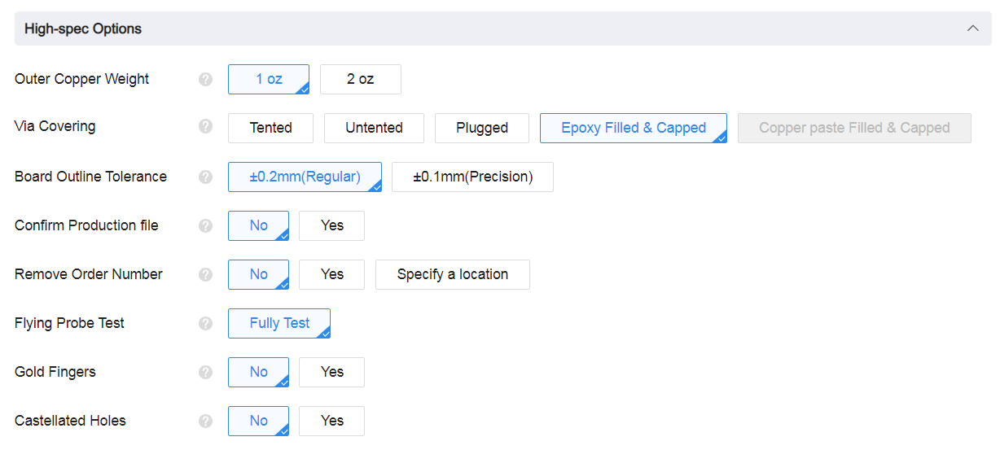

# How to Order from JLCPCB
First time ordering form JLCPCB, or PCBs in general? Or do you just need a refresher on ordering PCBs? Either way, you're in the right place!

## Getting Gerbers
PCB fabs take files called Gerbers. These are essentially outputted directions from whatever software you used (EasyEDA, KiCAD, etc) that contains information about the copper on the board, any silkscreen designs you have, and where to drill holes. Getting Gerbers are easy. They will usually be under some sort of `export` or `output` section of your software.

[//]: # (To-do: Add in section about EasyEDA export)

## Uploading to JLCPCB
Once you have your Gerbers, make sure they are zipped up. This is so that you can upload the folder all in one piece.

## What the Heck are These Settings?
PCB fabs have *A LOT* of settings for board manufacturing, and JLCPCB is no exception. Here's a rundown on what each section means:

### Base Options

- **Base Material**: What material you're going to make the PCBs out of. For OnBoard purposes, you'll board will be made out of FR-4.
- **Layers**: These are the number of copper layers that are in your design. This field should be auto filled with what JLCPCB detects in your Gerbers. 2 or 4 layer PCBs are the most common. Note that anything 6 and above will cost more!
- **Dimensions:**: The size of your PCB. Field should be auto-populated based off of your gerbers.
- **PCB QTY:**: Number of PCBs you're ordering.
- **Product Type**: Don't worry too much about this setting. It mostly deals with what level of care JLCPCB needs to handle your boards with (i.e medical cannot have lead on it). Keep it Industrial/Consumer Electronics.

### PCB Specifications

- **Different Design**: This is the number of designs within your gerber files. This number will be automatically calculated, so don't worry too much about it!
- **Delivery Format**: Do you want single cut PCBs? Or is your board small enough to be made into a panel? For most boards, `Single PCB` will be enough. If you're board is key-chain sized, think about whether you want to make it into a panel. If you have questions about panelization, send them into [`onboard-help`]()
- **PCB Thickness**: This is the thickness of your board. The default size is 1.6 mm. Unless you have a special application, I would not differ from it.
- **PCB Color**: 
- **Silkscreen**: 
- **Surface Finish**: 

### High-spec Options

- **Outer Copper Weight**: 
- **Via Covering**: 
- **Board Outline Tolerance**: 
- **Confirm Production File**: 
- **Remove Order Number**: 
- **Flyer Probe Test**: 
- **Gold Fingers**: 
- **Castellated Holes**: 

[//]: # (To-do: Add in section about assembly)