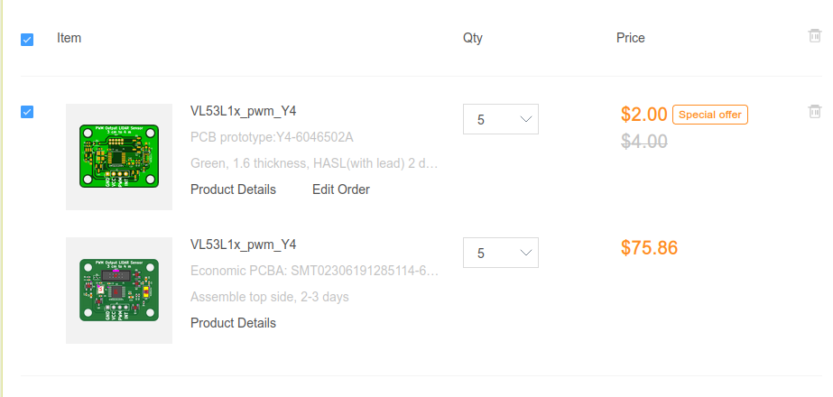
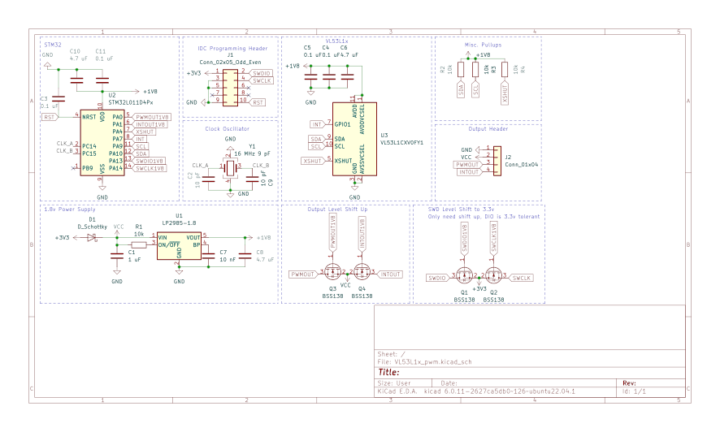

# VL53L1x_pwm
## Summary
The VL53L1x and company are great sensors with a lot of utility, but the I2C protocol and required device drivers can be quite clumsy in certain applications. This board uses a STM32 microcontroller in a very small form factor to adapt from that protocol to a standard duty-cycle output at the logic level that it is powered with.

## Fabrication
Gerber files, BOM and component placement files can be found in /VL53L1x_pwm/JLC_output. To ensure that those files are up-to-date with the source, run:
```
$ pip3 install kikit
$ chmod +x VL53L1x_pwm/KiKitJLCGen.sh
$ VL53L1x_pwm/KiKitJLCGen.sh
```
The shell script can trivially be converted to a batchfile for Windows users.

JLC's SMT assembly GUI doesn't automatically assign a part for a few parts. I used NX3225SA-16MHZ-EXS00A-CS10477 for crystal Y1 and X1270WV-2x05B-6TV01 for connector J1. Otherwise, generic passive components like resistors and capacitors generally have no requirements other than their footprint and value (capacitor C1 needs to be rated for 16v).

## Plan


The boards are quite small and only 2-layer, so the cost comes to only $4 for all 5 boards. The assembly takes up most of the budget, coming to $75.86. Shipping wasn't shown, but I expect it to cost <$20 given the size of the boards and prior experience with JLC.

The board is pretty much done after I recieve it, so all I have to do is write the firmware for the device. That should be quite easy with STM32duino and an STLink for SWD programming.

## Design


I started this project planning to use the VL53C4x sensor for its slightly better performance. I also planned to use a small-form-factor STM32 for the ease of programming that it offered and prior personal experience with STM32F04 and F09 ARM M0 processors. 

At this point I ran into a conflict between a small, inexpensive microcontroller and VL53C4x, as I found that the (required) STM device drivers used upwards of 50 kB of flash memory, which was well over total internal flash budget. If I had more experience with embedded development, I probably could have made this work with execute-in-place on a SPI external flash chip, but I didn't really think that was feasible.

Pivoting to the VL53L1x, my job was a lot easier as the drivers only use \~2.3 kB of flash. The VL53L1x specifically operates at 1.6v\~2.8v logic level, which drove my choice specifically to the STM32L011k for its 1.8v operating level. Doing an I2C shift would be possible, but would introduce a lot of potential problems with high-speed communications. Just shifting SWD and the PWM output would be a lot easier.

A last-minute addition was the INT (interrupt) output pin, as I realized that the sensor update rates weren't quite as good as I thought, and so downstream devices could easily find a notification of new updates useful.

---

[X] I am a current high school, middle school, or home schooled student.

[X] I have filled out the [verification form](https://airtable.com/shrbcDANe6ug6gj0p)

[X] I have joined the [`#onboard`](https://hackclub.slack.com/archives/C056AMWSFKJ) channel on Slack

[X] I made this board from scratch, even if I followed a tutorial

[X] I have followed [DIRECTIONS.md](https://github.com/hackclub/OnBoard/directions.md)

[X] Created a folder under `onboard/projects`

[X] Filled out `TEMPLATE.md`

[X] Uploaded Gerber and design files

[X] Uploaded screen shot of PCB passing vendor inspection

[X] I am ordering the smallest batch size (ie. JLCPCB's smallest order is for 5 boards)

[X] If outside the US I've checked that I can afford the customs charges in my country (which isn't covered by the grant)